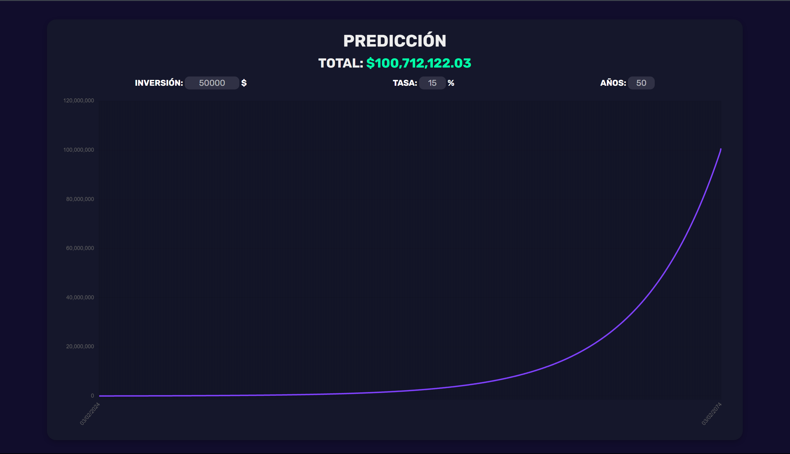

# Calculadora de Interés Compuesto

¡Bienvenido a la Calculadora de Interés Compuesto! Esta interfaz web amigable, alojada en GitHub, está diseñada para ofrecerte una experiencia envolvente al explorar el fascinante mundo del interés compuesto.

## Características Destacadas

- **Intuitiva y Amigable:** Un formulario sencillo te guiará para ingresar tus datos financieros sin complicaciones.

- **Visualización Dinámica:** Observa en tiempo real cómo crece tu inversión con una representación gráfica interactiva.

## Cómo Usar

1. Ingresa tus datos en el formulario.
2. Observa la visualización gráfica que muestra el impacto del interés compuesto.
3. Analiza estadísticas clave para evaluar el rendimiento de tu inversión.

## Colaboración en GitHub

Este proyecto es de código abierto. Si tienes ideas para mejoras, encuentras problemas o quieres contribuir, ¡tu participación es bienvenida! Explora el código en GitHub y únete.

## Optimiza Tu Futuro Financiero

Descubre el poder del interés compuesto y toma decisiones financieras informadas. ¡Optimiza tu futuro financiero ahora mismo con la Calculadora de Interés Compuesto!

---

*Nota: Este proyecto es solo con fines educativos y no ofrece asesoramiento financiero profesional.*
